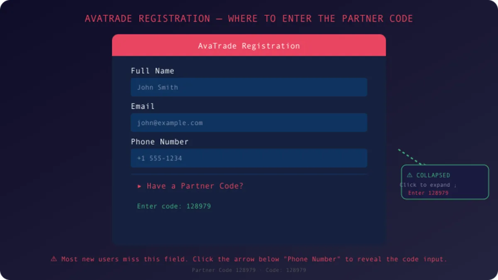

<!--
__      __  _______ _____            _____  ______ 
/\ \    / /\|__   __|  __ \     /\   |  __ \|  ____|
/  \ \  / /  \  | |  | |__) |   /  \  | |  | | |__   
/ /\ \ \/ / /\ \ | |  |  _  /   / /\ \ | |  | |  __|  
/ ____ \  / ____ \| |  | | \ \  / ____ \| |__| | |____ 
/_/    \_\/_/    \_\_|  |_|  \_\/_/    \_\_____/|______|
                                                         
 _____  ________      _______ ________          __
|  __ \|  ____\ \    / /_   _|  ____\ \        / /
| |__) | |__   \ \  / /  | | | |__   \ \  /\  / / 
|  _  /|  __|   \ \/ /   | | |  __|   \ \/  \/ /  
| | \ \| |____   \  /   _| |_| |____   \  /\  /   
|_|  \_\______|   \/   |_____|______|   \/  \/    
                                                   
-->

# AvaTrade Review: Full Broker Analysis (2026)

**Founded:** 2006 · **Regulation:** FCA, ASIC, CySEC · **Instruments:** 1,250+ · **Min Deposit:** $100

<p align="center">
  <picture>
    <source srcset="images/review-header.webp" type="image/webp">
    
  </picture>
</p>

---

## Contents

1. [Overview](#overview)
2. [Regulation](#regulation)
3. [Trading Platforms](#trading-platforms)
4. [Markets and Instruments](#markets-and-instruments)
5. [Fees and Spreads](#fees-and-spreads)
6. [Deposit and Withdrawal](#deposit-and-withdrawal)
7. [Welcome Bonus](#welcome-bonus)
8. [Pros and Cons](#pros-and-cons)
9. [Who Is It For?](#who-is-it-for)
10. [Verdict](#verdict)
11. [Links](#links)

---

## Overview

```
  Founded:       2006
  Headquarters:  Dublin, Ireland
  Regulation:    FCA, ASIC, CySEC, FSCA, ISA, FSA
  Instruments:   1,250+
  Platforms:     MT4, MT5, AvaTradeGO, WebTrader
  Min Deposit:   $100
  Max Leverage:  1:30 (retail EU) / 1:400 (pro)
  Spreads:       From 0.9 pips (EUR/USD)
  Inactivity:    $50/quarter after 3 months
```

AvaTrade is one of the longer-standing brokers in the industry. Founded in 2006, it has been through multiple market cycles and regulatory changes. With 6 regulatory licenses across 3 continents and 1,250+ instruments, it competes with brokers like IG, eToro, and Plus500.

---

## Regulation

| Regulator | Jurisdiction | Protection |
|-----------|-------------|------------|
| FCA | United Kingdom | FSCS up to 85,000 GBP |
| ASIC | Australia | Segregated accounts |
| CySEC | Europe | ICF up to 20,000 EUR |
| FSCA | South Africa | Segregated accounts |

AvaTrade is among the most regulated brokers. Multiple Tier-1 regulators means a strong safety framework. Client funds are held in segregated accounts.

---

## Trading Platforms

| Platform | Type | Best For |
|----------|------|----------|
| MetaTrader 4 | Desktop, Mobile, Web | Classic traders |
| MetaTrader 5 | Desktop, Mobile, Web | Advanced traders |
| AvaTradeGO | Mobile app | On-the-go trading |
| WebTrader | Browser | Quick access, no download |

MT4 supports Expert Advisors and custom indicators. MT5 adds more timeframes, more instruments, and depth of market. AvaTradeGO is the mobile-native option with copy trading and push notifications. WebTrader works in any browser with no installation needed.

---

## Markets and Instruments

  - Forex: 55+ currency pairs
  - Indices: Major global indices
  - Stocks: Shares of top companies
  - Crypto: Bitcoin, Ethereum, and more
  - Commodities: Gold, oil, silver, agricultural
  - ETFs: Exchange-traded funds
  - Bonds: Government and corporate

Total: 1,250+ instruments.

---

## Fees and Spreads

### Trading Fees

| Instrument | Typical Spread |
|------------|---------------|
| EUR/USD | 0.9 pips |
| GBP/USD | 1.1 pips |
| Gold (XAU/USD) | 0.35-0.50 pips |
| Bitcoin | 0.75-1.0% |

No commissions on most instruments.

### Non-Trading Fees

| Fee Type | Amount |
|----------|--------|
| Account Maintenance | $0 |
| Deposit Fees | $0 (most methods) |
| Withdrawal Fees | $0 (1 free/month) |
| Inactivity Fee | $50/quarter after 3 months |
| Overnight Financing | Swap rates apply |

---

## Deposit and Withdrawal

| Method | Min Deposit | Processing |
|--------|:-----------:|:----------:|
| Credit/Debit Card | $100 | Instant |
| Bank Wire | $100 | 2-5 days |
| PayPal | $100 | Instant |
| Skrill | $100 | Instant |
| Neteller | $100 | Instant |

---

## Welcome Bonus

New traders can claim a tiered welcome bonus up to $14,000 by entering partner code 128979 during registration.

| Deposit | Bonus | Effective Rate |
|:-------:|:-----:|:--------------:|
| $500 | $100 | 20% |
| $2,000 | $400 | 20% |
| $5,000 | $750 | 15% |

Tested with real deposits. All bonuses credited within 12 minutes to 2 hours.

Full details: [tradetheday.com/brokers/avatrade/partner-code](https://tradetheday.com/brokers/avatrade/partner-code)

---

## Pros and Cons

### Pros

| Pro | Why It Matters |
|-----|----------------|
| Multi-regulated | FCA + ASIC + CySEC = strong protection |
| 19+ years in business | Not a fly-by-night operation |
| 4 platform options | MT4, MT5, AvaTradeGO, WebTrader |
| 1,250+ instruments | Diversify across multiple asset classes |
| Competitive spreads | From 0.9 pips on EUR/USD |
| Bonus up to $14k | Verified with real deposits |
| Demo account | Free, unlimited |

### Cons

| Con | Why It Matters |
|-----|----------------|
| No US clients | Not available to US residents |
| Inactivity fee | $50/quarter after 3 months |
| Market maker model | Some traders prefer ECN/STP |
| Limited research tools | Less than competitors like IG or Saxo |

---

## Who Is It For?

Good for:
- New traders who want a demo account, education, and low minimum deposit
- Mobile traders who need a solid app (AvaTradeGO)
- Multi-asset traders who want 1,250+ instruments
- EA and algorithmic traders who use MT4/MT5

Not ideal for:
- US residents
- Pure scalpers (market maker model)
- Ultra-low spread seekers (ECN/STP is cheaper elsewhere)

---

## Verdict

AvaTrade is a well-established, multi-regulated broker with strong platform choice and competitive pricing. The welcome bonus is tested and verified. If you are opening an account, use partner code 128979 during registration. The code field is below the phone number. Do not miss it.

---

## Links

| Resource | Link |
|----------|------|
| Full AvaTrade Review | [tradetheday.com/brokers/avatrade](https://tradetheday.com/brokers/avatrade) |
| Partner Code 128979 Guide | [tradetheday.com/brokers/avatrade/partner-code](https://tradetheday.com/brokers/avatrade/partner-code) |
| AvaTrade Bonus Code | [tradetheday.com/bonus-codes/avatrade-bonus-code](https://tradetheday.com/bonus-codes/avatrade-bonus-code) |
| Official Website | [avatrade.com](https://www.avatrade.com) |

---

## Disclaimer

CFDs are complex instruments and come with a high risk of losing money rapidly due to leverage. You should consider whether you understand how CFDs work and whether you can afford the high risk of losing your money. This review is for informational purposes only and does not constitute financial advice.

---

<p align="center">
  <sub>github.com/tradetheday/avatrade-review</sub>
  <br>
  <sub>Review updated: July 2026</sub>
</p>
